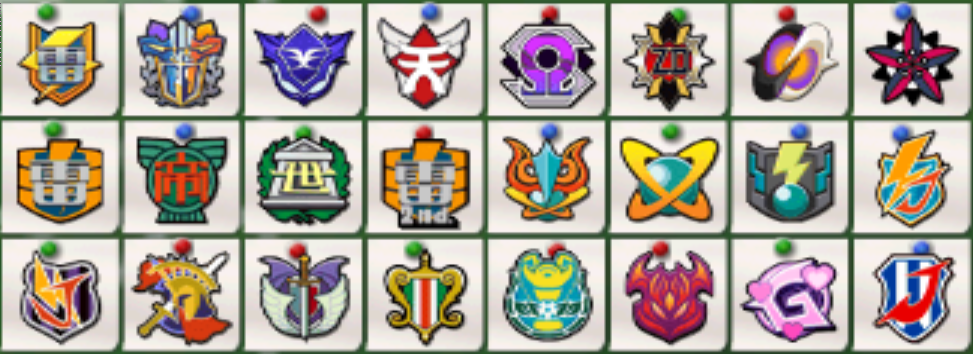
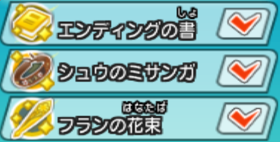

  

閃電十一人王牌前鋒 2013 的遊戲中有數種特殊技，需要解鎖的大多是合體技，化身技和一些極限融合時的特殊技。

本篇主要是針對如何解鎖合體技(化身技只要提昇覺醒值即可習得)。

而完整的特殊技依威力排序，請見:
[html 版本](inazuma-eleven-go-strikers-2013-all-special-moves.html)/
[md 版本](inazuma-eleven-go-strikers-2013-all-special-moves.md).

> **請注意**:
> 
> 極限融合狀態的球員只能使用合體技，如果在SP位置配招為化身或是武裝技，
> 將在完成極限融合時變成空的，**可在配招選單中依提示切換查看(如雙截棍是'-')**。
> 
> 而盤球技可以是武裝技。
> 
> 本篇以英文字母排序，若想了解如何解鎖角色或是極限融合，請看本篇底。

  
# 各隊隊徽

|        |          |        |        |          |          |        |        |
|--------|----------|--------|--------|----------|----------|--------|--------|
|新生雷門|革命選拔  |第五院  |天馬隊  |奧米迦協議|扎納克領域|零隊    |破壞者隊|
|第一雷門|帝國學園  |世宇子  |第二雷門|混沌紀元  |外星學園  |暗黑帝王|閃電日本|
|新日本  |世界選拔改|黑暗天使|吟遊詩人|小巨人    |王牙      |女子隊  |日本傳奇|

* 外星學園即**星之使徒**

# 基本操作 (雙截棍)
* 傳球 (**A** 鍵)
* 踢球 (**B** 鍵)
  + 長按蓄力，可強踢，若氣滿(一圈藍色閃電)，則開始攢必殺技等級(Lv1 -> Lv2 -> Lv3 -> SP)
  + 不過必須TP夠才能啟用高等級的必殺技。 (例如TP只夠到Lv2，就沒辦法啟用Lv3, SP...)
* 換人 (**C** 鍵)
* 跑 (**Z** 鍵)
* 英雄時間 (**C+Z** 鍵)
* 換人 ( **-** 鍵)
  + 會出現一本書的圖示
  + 有得分或犯規等事件時才換，也能進行補TP等操作
* 基本盤球技 (右手**十字**鍵)
  + 風型衝鋒、火型衝鋒、技巧盤球、跳動、滾動、可愛...
  + 風、火衝鋒較實用，技巧盤球次之
  + 風火衝連三次會有硬直時間(僵住)，可用傳球鍵解除僵直，繼續衝鋒
    - A: 按住傳球鍵
    - R: 放開傳球鍵
    - D: 按、放十字鍵(通常是下鍵)
    - (DDD) (ADR DD) (ADR DD) (ADR ...
    - 時間要拿捏好，過早 R 會把球踢出

  
# 必殺技 (在配招畫面可查看)
* 射門技
  + **B**
    - 可反踢或減弱對手的射門技
    - 射門路徑有經過，用 **踢球(B鍵)** 發動
  + **L**
    - 相較一般射門必殺技，可長距離發動而威力不太減少
* 盤球技
  + 可與對手的阻截技比拼，拼贏的得球，輸贏都會耗TP，但輸的耗得少(？)
* 阻截技
  + **B**
    - 有此標示的可阻擋射門，但威力不若射門+B，而且頂多只能守下球，不能反踢
    - 射門路徑有經過，用**搖晃右手**發動
  + 可與對手的盤球技比拼，拼贏的得球，輸贏都會耗TP，但輸的耗得少(？)
* 守門技
  + **P1** (P = punch，不是接住，而是會擊打出去的守門技，P1擊打出的距離較P2近)
  + **P2**
* 有解鎖極限融合者，可按 **-** 查看融合狀態時的配招

# 合體射門技

  
  
  

<table style="width:96%;">
<colgroup>
<col style="width: 16%" />
<col style="width: 16%" />
<col style="width: 16%" />
<col style="width: 16%" />
<col style="width: 16%" />
<col style="width: 16%" />
</colgroup>
<tbody>
<tr class="odd">
<td><strong>必殺技</strong></td>
<td><strong>解鎖</strong></td>
<td><strong>發動</strong></td>
<td><strong>配合</strong></td>
<td><strong>元素</strong></td>
<td><strong>TP</strong></td>
</tr>
<tr class="even">
<td>ビッグ バン 
(Big Bang) <b>大霹靂/大重擊</b></td>
<td>基山/吉良浩人, 吹雪士郎 and 鬼道有人 (閃電日本隊) 
絆100%</td>
<td>基山/吉良浩人</td>
<td>吹雪士郎 and 鬼道有人</td>
<td>火</td>
<td>50</td>
</tr>
<tr class="odd">
<td>バタフライ ドリーム 
(Butterfly Dream) 
<em>Butterfly Trance</em> <b>夢蝶凌舞</b></td>
<td>浦部莉香 and 財前塔子 
絆50%</td>
<td>浦部莉香, 財前塔子 or 御堂玲華</td>
<td>財前塔子, 浦部莉香 or 御堂玲華</td>
<td>山</td>
<td>40</td>
</tr>
<tr class="even">
<td>カオスブレイク 
(Chaos Break) <b>神威炸裂/混沌炸裂</b></td>
<td>亞風爐照美 (世界選抜改), 南雲晴矢, 涼野風介 (火焰神龍隊) 
絆100%</td>
<td>亞風爐照美</td>
<td>南雲晴矢 (炎) and 涼野風介 (翔)</td>
<td>林</td>
<td>50</td>
</tr>
<tr class="odd">
<td>クロスファイア 
(Cross Fire) <b>聖十字火焰</b></td>
<td>豪炎寺修也 (第二雷門) and 吹雪士郎 (閃電日本隊) 
絆75%</td>
<td>豪炎寺修也 or 吹雪士郎</td>
<td>吹雪士郎 or 豪炎寺修也</td>
<td>火 / 
風</td>
<td>40</td>
</tr>
<tr class="even">
<td>ダークフェニックス 
(Dark Phoenix)</td>
<td>風丸一郎太, 染岡龍吾 and 松野空介 (暗黑帝王隊) 
絆100%</td>
<td>風丸一郎太</td>
<td>染岡龍吾 and 松野空介</td>
<td>林</td>
<td>30</td>
</tr>
<tr class="odd">
<td>デスブレイク 
(Death Break) 
<em>Doom Break</em></td>
<td>巴特寶斯列特, 米斯托雷涅卡魯斯 and 艾斯卡帕梅魯 (王牙) 
絆100%</td>
<td>巴特寶斯列特</td>
<td>米斯托雷涅卡魯斯 and 艾斯卡帕梅魯</td>
<td>山</td>
<td>50</td>
</tr>
<tr class="even">
<td>デスゾーン 
(Death Zone) <b>死亡領域</b></td>
<td>不需解鎖</td>
<td>佐久間次郎, 寺門大貴 or 洞面秀一郎</td>
<td>寺門大貴, 洞面秀一郎 or 佐久間次郎</td>
<td>林</td>
<td>30</td>
</tr>
<tr class="odd">
<td>デスゾーン2 
(Death Zone 2) <b>死亡領域2</b></td>
<td>鬼道有人, 圓堂守, 土門飛鳥 (第二雷門) 
絆100%</td>
<td>鬼道有人 or 音無春奈</td>
<td>選2人) 圓堂守, 土門飛鳥, 鬼道有人, 雷門夏未, 木野秋, 久遠冬花 and 音無春奈</td>
<td>林</td>
<td>30</td>
</tr>
<tr class="even">
<td>ドラゴントルネード 
(Dragon Tornado) <b>龍型龍捲風/青龍咆哮</b></td>
<td>染岡龍吾 and 豪炎寺修也 
(第一雷門) 
絆50%</td>
<td>染岡龍吾 or 豪炎寺修也</td>
<td>豪炎寺修也 or 染岡龍吾</td>
<td>火</td>
<td>30</td>
</tr>
<tr class="odd">
<td>エボリューション 
(Evolution) <b>進化射門</b></td>
<td>松風天馬, 神童拓人 and 劍城京介 (新生雷門) 
絆75%</td>
<td>松風天馬, 瀨戶水鳥 or San</td>
<td>神童拓人, 劍城京介, 空野葵, 山菜茜, 阿斯塔 (破壞者隊) and 芙蘭 (破壞者隊)</td>
<td>山</td>
<td>40</td>
</tr>
<tr class="even">
<td>エクストリームラビット 
(Extreme Rabbit)  <b>極致之兔</b></td>
<td>松風天馬 (天馬隊) and 菲魯恩 
絆50%</td>
<td>松風天馬 and 菲魯恩</td>
<td>菲魯恩 and 松風天馬</td>
<td>山</td>
<td>40</td>
</tr>
<tr class="odd">
<td>エクストリームラビット アームド 
(Extreme Rabbit Armed)  <b>武裝形態:極致之兔</b></td>
<td>松風天馬 (天馬隊) and 菲魯恩 
絆50%, both with 最高覺醒值</td>
<td>松風天馬 and 菲魯恩</td>
<td>菲魯恩 and 松風天馬</td>
<td>山</td>
<td>60</td>
</tr>
<tr class="even">
<td>ファイアブリザード 
(Fire Blizzard) <b>烈火冰風暴</b></td>
<td>炎 and 翔 (混沌紀元隊) 
絆100%</td>
<td>炎 (南雲晴矢) or 翔 (涼野風介)</td>
<td>翔 (涼野風介) or 炎 (南雲晴矢)</td>
<td>火 / 
風</td>
<td>40</td>
</tr>
<tr class="odd">
<td>炎の風見鶏 [Long] 
(Honoo no kazamidori) 
<em>Fire Rooster</em></td>
<td>風丸一郎太 and 豪炎寺修也 
(第一雷門) 
絆50%</td>
<td>風丸一郎太 or 豪炎寺修也</td>
<td>豪炎寺修也 or 風丸一郎太</td>
<td>火</td>
<td>30</td>
</tr>
<tr class="even">
<td>ファイアトルネードDD 
(Fire Tornado Double Drive)  <b>烈焰龍捲風DD</b>  
</td>
<td>松風天馬 and 劍城京介 (新生雷門) 
絆100%</td>
<td>松風天馬, 劍城京介, 黒裂真命, 菜花黄名子 or 豪炎寺修也</td>
<td>劍城京介, 黒裂真命, 菜花黄名子, 豪炎寺修也 or 松風天馬</td>
<td>火</td>
<td>40</td>
</tr>
<tr class="odd">
<td>ファイアトルネードTC 
(Fire Tornado Triple Crusher)  <b>烈焰龍捲風TC</b>  
</td>
<td>松風天馬 (天馬隊), 劍城京介 and 雨宮太陽 
絆100%</td>
<td>松風天馬, 劍城京介, 雨宮太陽, 菜花黄名子 or 白龍</td>
<td>劍城京介, 雨宮太陽, 菜花黄名子, 白龍 or 松風天馬</td>
<td>火</td>
<td>40</td>
</tr>
<tr class="even">
<td>ファイアトルネードTC アームド 
(Fire Tornado Triple Crusher Armed)  <b>武裝形態: 烈焰龍捲風TC</b>  
</td>
<td>松風天馬 (天馬隊), 劍城京介 and 雨宮太陽 
絆100%, 每個人都最高覺醒值</td>
<td>松風天馬, 劍城京介, 雨宮太陽, 菜花黄名子 or 白龍</td>
<td>劍城京介, 雨宮太陽, 菜花黄名子, 白龍 or 松風天馬</td>
<td>火</td>
<td>50</td>
</tr>
<tr class="odd">
<td>ガイアブレイク 
(Gaia Break) <b>彗星撞擊</b></td>
<td>不需解鎖</td>
<td>武藤論, 皇マキ, 瀬方隆一郎, 厚石茂人 or 雷傑 (綠川龍二)</td>
<td>皇マキ, 瀬方隆一郎, 厚石茂人, 雷傑 (綠川龍二) or 武藤論</td>
<td>山</td>
<td>30</td>
</tr>
<tr class="even">
<td>グランフュンリル 
(Gran Fenrir) <b>巨狼芬里爾</b></td>
<td>Mark(世界選拔改), Dylan(世界選拔改) and 一之瀨一哉 (世界選抜改) 
絆75%</td>
<td>Mark(世界選拔改)</td>
<td>Dylan(世界選拔改) and 一之瀨一哉</td>
<td>林</td>
<td>40</td>
</tr>
<tr class="odd">
<td>グランドファイア [Long] 
(Grand Fire) <b>烈火巨炎</b></td>
<td>豪炎寺修也, 宇都宮虎丸 and 基山/吉良浩人 (閃電日本隊) 
絆75%</td>
<td>豪炎寺修也</td>
<td>宇都宮虎丸 and 基山/吉良浩人</td>
<td>火</td>
<td>30</td>
</tr>
<tr class="even">
<td>グレートブラスター 
(Great Blaster) <b>壯烈衝擊波</b></td>
<td>劍城京介 and 白龍 
絆100%</td>
<td>劍城京介, 白龍 or 劍城優一</td>
<td>白龍, 劍城京介 or 劍城優一</td>
<td>無</td>
<td>40</td>
</tr>
<tr class="odd">
<td>グレートブラスター アームド 
(Great Blaster Armed) <b>武裝: 壯烈衝擊波</b></td>
<td>劍城京介 and 白龍 
絆100%, both with 覺醒3</td>
<td>劍城京介, 白龍 or 劍城優一</td>
<td>白龍, 劍城京介 or 劍城優一</td>
<td>無</td>
<td>60</td>
</tr>
<tr class="even">
<td>イナズマ1号 
(Inazuma Ichi-gō) 
<em>Inazuma-1</em> <b>閃電一號射門</b></td>
<td>圓堂守 and 豪炎寺修也 
(第一雷門) 
絆75%</td>
<td>圓堂守 or 豪炎寺修也</td>
<td>豪炎寺修也 or 圓堂守</td>
<td>風</td>
<td>30</td>
</tr>
<tr class="odd">
<td>イナズマ1号落とし 
(Inazuma Ichi-gō Otoshi) 
<em>Inazuma-1 Drop</em> <b>閃電一號射門落雷</b></td>
<td>壁山塀吾郎, 圓堂守 and 豪炎寺修也 
(第一雷門) 
絆100%</td>
<td>壁山塀吾郎</td>
<td>圓堂守 and 豪炎寺修也</td>
<td>風</td>
<td>30</td>
</tr>
<tr class="even">
<td>イナズマブレイク 
(Inazuma Break)</td>
<td>鬼道有人, 圓堂守 and 豪炎寺修也 
(第一雷門) 
絆75%</td>
<td>鬼道有人</td>
<td>圓堂守 and 豪炎寺修也</td>
<td>風</td>
<td>30</td>
</tr>
<tr class="odd">
<td>イナズマ落とし 
(Inazuma Otoshi) 
<em>Inazuma Drop</em> <b>高空落雷射門</b></td>
<td>壁山塀吾郎 and 豪炎寺修也 
(第一雷門) 
絆50%</td>
<td>壁山塀吾郎 or 豪炎寺修也</td>
<td>豪炎寺修也 or 壁山塀吾郎</td>
<td>風</td>
<td>30</td>
</tr>
<tr class="even">
<td>ジェットストリーム [Long] 
(Jet Stream) <b>噴射氣旋</b></td>
<td>圓堂守, 豪炎寺修也 and 宇都宮虎丸 (閃電日本隊) 
絆100%</td>
<td>圓堂守 or 不動明王</td>
<td>豪炎寺修也 and 宇都宮虎丸</td>
<td>山</td>
<td>50</td>
</tr>
<tr class="odd">
<td>ジョーカーレインズ 
(Joker Rains) <b>愚者之雨</b></td>
<td>神童拓人 and 劍城京介 (新生雷門) 
絆75%</td>
<td>神童拓人, 劍城京介, Kamomi (破壞者隊) or Okiddo (破壞者隊)</td>
<td>劍城京介, 神童拓人, Kamomi (破壞者隊) or Okiddo (破壞者隊)</td>
<td>林</td>
<td>40</td>
</tr>
<tr class="even">
<td>ジョーカーレインズ アームド 
(Joker Rains Armed) <b>武裝: 愚者之雨</b></td>
<td>神童拓人 and 劍城京介 (新生雷門) 
絆75%, both with 覺醒3</td>
<td>神童拓人 or 劍城京介</td>
<td>劍城京介 or 神童拓人</td>
<td>林</td>
<td>60</td>
</tr>
<tr class="odd">
<td>皇帝ペンギン2号 
(Kōtei Penguin ni-gō) 
<em>Emperor Penguin No.2</em></td>
<td>不需解鎖 
(just 買進 帝國學園/Royal Academy 鬼道有人)</td>
<td>鬼道有人</td>
<td>選2人) 豪炎寺修也, 染岡龍吾, 一之瀨一哉, 佐久間次郎, 寺門大貴, 風丸一郎太, 吹雪士郎 and 不動明王</td>
<td>林</td>
<td>20</td>
</tr>
<tr class="even">
<td>皇帝ペンギン3号 
(Kōtei Penguin san-gō) 
<em>Emperor Penguin No.3</em></td>
<td>鬼道有人, 佐久間次郎 and 不動明王 (閃電日本隊) 
絆100%</td>
<td>鬼道有人, 佐久間次郎 or 不動明王</td>
<td>選2人) 佐久間次郎, 不動明王 or 鬼道有人</td>
<td>林</td>
<td>40</td>
</tr>
<tr class="odd">
<td>ラスト・デスゾーン 
(Last Death Zone) <b>最後死亡領域</b> 
</td>
<td>鬼道有人, 佐久間次郎 and 不動明王 (日本傳奇隊) 
絆100%</td>
<td>鬼道有人, 佐久間次郎 or 不動明王</td>
<td>選2人) 佐久間次郎, 不動明王, 鬼道有人, 基山/吉良浩人 and 染岡龍吾</td>
<td>林</td>
<td>50</td>
</tr>
<tr class="even">
<td>メガネクラッシュ 
(目金欠流 Crash) 
<em>Spectacle Crash</em></td>
<td>不需解鎖</td>
<td>目金欠流, 染岡龍吾, 一之瀨一哉, 豪炎寺修也, 吹雪士郎, 浦部莉香, Maygar (小巨人隊), Goushu (小巨人隊) and Drago (小巨人隊)</td>
<td>目金欠流, 染岡龍吾, 一之瀨一哉, 豪炎寺修也, 吹雪士郎, 浦部莉香, Maygar (小巨人隊), Goushu (小巨人隊) or Drago (小巨人隊)</td>
<td>山</td>
<td>20</td>
</tr>
<tr class="odd">
<td>オメガアタック 
(Omega Attack)</td>
<td>阿爾法(奧米迦協議隊), 貝塔(奧米迦協議隊) and 伽瑪(奧米迦協議隊) 
絆100%</td>
<td>阿爾法(奧米迦協議隊), 貝塔(奧米迦協議隊) or 伽瑪(奧米迦協議隊)</td>
<td>選2人) 阿爾法(奧米迦協議隊), 貝塔(奧米迦協議隊) or 伽瑪(奧米迦協議隊)</td>
<td>無</td>
<td>40</td>
</tr>
<tr class="even">
<td>オメガアタック アームド 
(Omega Attack Armed)</td>
<td>阿爾法(奧米迦協議隊), 貝塔(奧米迦協議隊) and 伽瑪(奧米迦協議隊) 
絆100%, 每個人都覺醒3</td>
<td>阿爾法(奧米迦協議隊), 貝塔(奧米迦協議隊) or 伽瑪(奧米迦協議隊)</td>
<td>選2人) 阿爾法(奧米迦協議隊), 貝塔(奧米迦協議隊) or 伽瑪(奧米迦協議隊)</td>
<td>無</td>
<td>50</td>
</tr>
<tr class="odd">
<td>プライムレジェンド 
(Prime Legend) <b>領袖傳說</b></td>
<td>豪炎寺修也 and 鬼道有人 (第一雷門) 
絆100%</td>
<td>豪炎寺修也 or 鬼道有人</td>
<td>鬼道有人 or 豪炎寺修也</td>
<td>風</td>
<td>40</td>
</tr>
<tr class="even">
<td>レボリユーションV 
(Revolution V) <b>革命旋風V</b></td>
<td>半田真一 and 松野空介 (暗黑帝王隊) 
絆50%</td>
<td>半田真一 or 松野空介</td>
<td>松野空介 or 半田真一</td>
<td>風</td>
<td>30</td>
</tr>
<tr class="odd">
<td>最強イレブン波動 
(Saikyou Eleven Hadou)  <b>最強十一人波動</b></td>
<td>松風天馬 (新生雷門) 與這十人有50%絆: 神童拓人, 劍城京介, 菲魯恩, 西園信助, 霧野蘭丸, 托普, 菜花黄名子, 雨宮太陽, 錦龍馬, 扎納克，並且這11人都要解鎖極限融合</td>
<td>松風天馬 (發動時要與 亞瑟王 極限融合，而另兩個代表配合的不用進入極限融合狀態)</td>
<td>選2人) 神童拓人, 劍城京介, 菲魯恩, 西園信助, 霧野蘭丸, 托普, 菜花黄名子, 雨宮太陽, 錦龍馬 and 扎納克</td>
<td>風</td>
<td>20</td>
</tr>
<tr class="even">
<td>シャドウ･レイ 
(Shadow Ray)</td>
<td>Desuta(黑暗天使隊) and Sein (黑暗天使隊) 
絆75%</td>
<td>Desuta(黑暗天使隊) or Sein(黑暗天使隊)</td>
<td>Sein(黑暗天使隊) or Desuta(黑暗天使隊)</td>
<td>山 / 
林</td>
<td>40</td>
</tr>
<tr class="odd">
<td>スペースペンギン 
(Space Penguin) 
<em>Space Penguins</em> <b>太空企鵝</b></td>
<td>Gran (基山/吉良浩人), 八神玲名 and 伊豆野由宇 
絆75%</td>
<td>八神玲名</td>
<td>Gran and 伊豆野由宇</td>
<td>風</td>
<td>30</td>
</tr>
<tr class="even">
<td>スーパーノヴァ 
(Supernova) <b>超新星</b></td>
<td>Gran (基山/吉良浩人), 八神玲名 and 伊豆野由宇 
絆100%</td>
<td>Gran (基山/吉良浩人)</td>
<td>八神玲名 and 伊豆野由宇</td>
<td>林</td>
<td>30</td>
</tr>
<tr class="odd">
<td>ソードエクスカリバー 
(Sword Excalibur)</td>
<td>白龍 and 修 (零隊) 
絆100%</td>
<td>白龍</td>
<td>修</td>
<td>無</td>
<td>50</td>
</tr>
<tr class="even">
<td>ソード・オブ・ファイア 
(Sword of Fire) <b>火炎之劍</b></td>
<td>松風天馬, 神童拓人 and 劍城京介 (新生雷門) 
絆100%</td>
<td>松風天馬</td>
<td>神童拓人 and 劍城京介</td>
<td>火</td>
<td>50</td>
</tr>
<tr class="odd">
<td>タツマキオトシ 
(Tatsumaki Otoshi) 
<em>Whirlwind Drop</em> <b>旋風墜擊</b></td>
<td>風丸一郎太 and 壁山塀吾郎 (閃電日本隊) 
絆50%</td>
<td>風丸一郎太 or 壁山塀吾郎</td>
<td>壁山塀吾郎 or 風丸一郎太</td>
<td>風</td>
<td>40</td>
</tr>
<tr class="even">
<td>ザ･バース 
(The Birth) 
<em>The Dawn</em> <b>誕生/生命起源</b></td>
<td>吹雪士郎 and 基山/吉良浩人 (閃電日本隊) 
絆100%</td>
<td>吹雪士郎 or 基山/吉良浩人</td>
<td>基山/吉良浩人 or 吹雪士郎</td>
<td>風</td>
<td>40</td>
</tr>
<tr class="odd">
<td>ヅ・アース 
(The Earth) <b>地球之歌</b></td>
<td>圓堂守 (第二雷門), 豪炎寺修也 (第二雷門) and 吹雪士郎 (閃電日本隊) 
絆100%</td>
<td>圓堂守 or 雷門夏未</td>
<td>選2人) 豪炎寺修也, 吹雪士郎, 圓堂守, 音無春奈, 木野秋, 久遠冬花, 雷門夏未</td>
<td>山</td>
<td>50</td>
</tr>
<tr class="even">
<td>ザ・ハリケーン 
(The Hurricane) <b>極寒颶風</b></td>
<td>風丸一郎太 and 吹雪士郎 (閃電日本隊) 
絆75%</td>
<td>風丸一郎太, 吹雪士郎 or 宮坂了</td>
<td>吹雪士郎, 宮坂了 or 風丸一郎太</td>
<td>風</td>
<td>40</td>
</tr>
<tr class="odd">
<td>ザ・フェニックス 
(The Phoenix) <b>鳳凰展翅</b></td>
<td>一之瀨一哉, 圓堂守 and 土門飛鳥 
(第一雷門) 
絆75%</td>
<td>一之瀨一哉</td>
<td>圓堂守 and 土門飛鳥</td>
<td>火</td>
<td>30</td>
</tr>
<tr class="even">
<td>サンダービースト 
(Thunder Beast) <b>迅雷猛獸</b></td>
<td>土方雷電 and 吹雪士郎 (閃電日本隊) 
絆75%</td>
<td>土方雷電 or 吹雪士郎</td>
<td>吹雪士郎 or 土方雷電</td>
<td>風</td>
<td>40</td>
</tr>
<tr class="odd">
<td>タイガストーム 
(Tiger Storm)</td>
<td>宇都宮虎丸 and 豪炎寺修也 (閃電日本隊) 
絆50%</td>
<td>宇都宮虎丸 or 豪炎寺修也</td>
<td>豪炎寺修也 or 宇都宮虎丸</td>
<td>火</td>
<td>40</td>
</tr>
<tr class="even">
<td>トライペガサス 
(Tri Pegasus) <b>天馬三重奏</b></td>
<td>一之瀨一哉, 圓堂守 and 土門飛鳥 
(第一雷門) 
絆50%</td>
<td>一之瀨一哉</td>
<td>選2人) 圓堂守, 土門飛鳥 and 西垣守</td>
<td>風</td>
<td>30</td>
</tr>
<tr class="odd">
<td>トライアングルZ 
(Triangle Z) <b>死亡三角洲Z</b></td>
<td>砂木沼治, 瀬方隆一郎 and 伊豆野由宇 (新日本隊) 
絆75%</td>
<td>砂木沼治/迪薩姆 or 武方努</td>
<td>選2人) 瀬方隆一郎, 伊豆野由宇, 武方努 and 砂木沼治</td>
<td>火</td>
<td>30</td>
</tr>
<tr class="even">
<td>トライアングルZZ 
(Triangle Double Z) <b>死亡三角洲ZZ</b></td>
<td>貴志部大河, 瀧快彥 and 瀧總介 (革命選拔) 
絆50%</td>
<td>貴志部大河, 瀧快彥, 瀧總介 or 亞風爐照美</td>
<td>選2人) 瀧快彥, 瀧總介, 貴志部大河 and 亞風爐照美</td>
<td>火</td>
<td>30</td>
</tr>
<tr class="odd">
<td>トリプルブースト [Long] 
(Triple Boost) <b>三重爆發力</b></td>
<td>風丸一郎太, 栗松鐵平 and 宍戶佐吉 (暗黑帝王隊) 
絆75%</td>
<td>風丸一郎太, 栗松鐵平, 宍戶佐吉, Gianluca (吟遊詩人), 拉斐葉傑涅拉尼 (吟遊詩人) or Enrico (吟遊詩人)</td>
<td>栗松鐵平, 宍戶佐吉, 風丸一郎太, Gianluca (吟遊詩人), 拉斐葉傑涅拉尼 (吟遊詩人) or Enrico (吟遊詩人)</td>
<td>火</td>
<td>30</td>
</tr>
<tr class="even">
<td>ツインブースト 
(Twin Boost) <b>雙重噴射</b></td>
<td>不需解鎖</td>
<td>鬼道有人, 佐久間次郎 or 一之瀨一哉</td>
<td>佐久間次郎, 一之瀨一哉 or 鬼道有人</td>
<td>火</td>
<td>30</td>
</tr>
<tr class="odd">
<td>ツインブーストF 
(Twin Boost F)</td>
<td>鬼道有人 and 豪炎寺修也 
(第一雷門) 
絆50%</td>
<td>鬼道有人 or 豪炎寺修也</td>
<td>豪炎寺修也 or 鬼道有人</td>
<td>火</td>
<td>40</td>
</tr>
<tr class="even">
<td>ユニコーンブースト 
(Unicorn Boost) <b>獨角獸推進</b></td>
<td>Mark(世界選拔改) and Dylan(世界選拔改) 
絆50%</td>
<td>Mark(世界選拔改) or Dylan(世界選拔改)</td>
<td>Dylan(世界選拔改) or Mark(世界選拔改)</td>
<td>山</td>
<td>40</td>
</tr>
<tr class="odd">
<td>ユニバースブラスト 
(Universe Blast) 
<em>Cosmic Blast</em> <b>宇宙炸裂衝擊波</b></td>
<td>不需解鎖</td>
<td>雷傑 (綠川龍二), 三浦大夢 or 七風理夢</td>
<td>三浦大夢, 七風理夢 or 雷傑 (綠川龍二)</td>
<td>林</td>
<td>40</td>
</tr>
<tr class="even">
<td>ワイバーンブリザード 
(Wyvern Blizzard)</td>
<td>染岡龍吾 (第一雷門) and 吹雪士郎 FW (第二雷門) 
絆50%</td>
<td>染岡龍吾 or 吹雪士郎</td>
<td>吹雪士郎 or 染岡龍吾</td>
<td>風</td>
<td>40</td>
</tr>
<tr class="odd">
<td>ゼロマグナム 
(Zero Magnum) <b>麥格農零式</b></td>
<td>白龍 and 修 (零隊) 
絆75%</td>
<td>白龍 or 修</td>
<td>修 or 白龍</td>
<td>無</td>
<td>40</td>
</tr>
</tbody>
</table>

  
  
  
  

# 單人射門技

  
  
  

<table>
<colgroup>
<col style="width: 20%" />
<col style="width: 20%" />
<col style="width: 20%" />
<col style="width: 20%" />
<col style="width: 20%" />
</colgroup>
<tbody>
<tr class="odd">
<td><strong>必殺技</strong></td>
<td><strong>解鎖</strong></td>
<td><strong>發動</strong></td>
<td><strong>元素</strong></td>
<td><strong>TP</strong></td>
</tr>
<tr class="even">
<td>ゴッドウィンド 
(God Wind) <b>神明之風</b></td>
<td>松風天馬 (天馬隊) and 豪炎寺修也 (日本傳奇隊) 
絆50%</td>
<td>松風天馬</td>
<td>風</td>
<td>60</td>
</tr>
<tr class="odd">
<td>ゴッドウィンドアームド 
(God Wind Armed) <b>武裝:神明之風</b></td>
<td>松風天馬 (天馬隊) and 豪炎寺修也 (日本傳奇隊) 
絆50% and 松風天馬 (新生雷門) 覺醒3</td>
<td>松風天馬</td>
<td>風</td>
<td>70</td>
</tr>
<tr class="even">
<td>マキシマムファイア [Chain] 
(Maximum Fire) <b>傳奇火焰/極限烈火</b></td>
<td>豪炎寺修也 (第一雷門) 
覺醒3</td>
<td>豪炎寺修也</td>
<td>火</td>
<td>60</td>
</tr>
</tbody>
</table>

  
  
  
  

# 合體盤球技

  
  
  

<table style="width:96%;">
<colgroup>
<col style="width: 16%" />
<col style="width: 16%" />
<col style="width: 16%" />
<col style="width: 16%" />
<col style="width: 16%" />
<col style="width: 16%" />
</colgroup>
<tbody>
<tr class="odd">
<td><strong>必殺技</strong></td>
<td><strong>解鎖</strong></td>
<td><strong>發動</strong></td>
<td><strong>配合</strong></td>
<td><strong>元素</strong></td>
<td><strong>TP</strong></td>
</tr>
<tr class="even">
<td>合気道 
(Aikidou)</td>
<td>不需解鎖</td>
<td>館野舞 (女生隊)</td>
<td>財前塔子, 若無則任一個一般球員</td>
<td>風</td>
<td>30</td>
</tr>
<tr class="odd">
<td>エアライド 
(Air Ride)</td>
<td>不需解鎖</td>
<td>Windy(小巨人隊), Maxi(小巨人隊) or Drago (小巨人隊)</td>
<td>任一個一般球員</td>
<td>風</td>
<td>40</td>
</tr>
<tr class="even">
<td>ブリタニアクロス 
(Britannia Cross) <b>魔幻交叉</b></td>
<td>不需解鎖</td>
<td>青山俊介, 一乃七助 (新生雷門), 修, 海 (零隊), 龍崎皇兒, 湾田七雄人, 御門春馬 (第五院), 貴志部大河 or 瀧總介 (革命選拔)</td>
<td>青山俊介, 一乃七助 (新生雷門), 修, 海 (零隊), 龍崎皇兒, 湾田七雄人, 御門春馬, 浪川蓮助 (第五院), 貴志部大河 or 瀧總介 (革命選拔) 之一, 若無則任一個一般球員</td>
<td>火</td>
<td>40</td>
</tr>
<tr class="odd">
<td>ジャッジスルー 3 
(Judge Through 3) 
<em>Breakthrough 3</em></td>
<td>不需解鎖</td>
<td>巴特寶斯列特 (王牙) or Henktacker (世界選抜改)</td>
<td>鬼道有人, 砂木沼治, Jinisuki (王牙), 音無春奈 (女生隊), 真帆路正 (革命選拔), Demonio (世界選抜改), 多利露(天馬隊), 曼特(天馬隊), Chibitto(天馬隊) and 奇莫郎(天馬隊)</td>
<td>火</td>
<td>40</td>
</tr>
<tr class="even">
<td>無影走破 
(Muei Souha) 
</td>
<td>不需解鎖</td>
<td>雷伊路克</td>
<td>任兩個一般球員</td>
<td>無</td>
<td>30</td>
</tr>
<tr class="odd">
<td>キラーフィールズ 
(Killer Fields) 
<em>Field of Force</em> <b>球場殺戮者</b></td>
<td>鬼道有人 and 不動明王 (閃電日本隊) 
絆50%</td>
<td>鬼道有人 or 不動明王</td>
<td>不動明王 or 鬼道有人</td>
<td>林</td>
<td>30</td>
</tr>
<tr class="even">
<td>ジ・イカロス 
(The Icarus) <b>伊卡洛斯之翼</b></td>
<td>不需解鎖</td>
<td>Mark(世界選拔改)</td>
<td>土門飛鳥, 若無則任一個一般球員</td>
<td>火</td>
<td>40</td>
</tr>
</tbody>
</table>

  
  
  
  

# 單人盤球技

  
  
  

<table>
<colgroup>
<col style="width: 20%" />
<col style="width: 20%" />
<col style="width: 20%" />
<col style="width: 20%" />
<col style="width: 20%" />
</colgroup>
<tbody>
<tr class="odd">
<td style="text-align: center;"><strong>必殺技</strong></td>
<td style="text-align: center;"><strong>解鎖</strong></td>
<td style="text-align: center;"><strong>發動</strong></td>
<td style="text-align: center;"><strong>元素</strong></td>
<td style="text-align: center;"><strong>TP</strong></td>
</tr>
<tr class="even">
<td style="text-align: center;">風穴ドライブ 
(Kazaana Drive) <b>風穴驅動</b></td>
<td style="text-align: center;">松風天馬 (天馬隊) and 風丸一郎太 (日本傳奇隊) 
絆50%</td>
<td style="text-align: center;">松風天馬</td>
<td style="text-align: center;">風</td>
<td style="text-align: center;">40</td>
</tr>
</tbody>
</table>

  
  
  
  

# 合體阻截技

  
  
  

<table style="width:96%;">
<colgroup>
<col style="width: 16%" />
<col style="width: 16%" />
<col style="width: 16%" />
<col style="width: 16%" />
<col style="width: 16%" />
<col style="width: 16%" />
</colgroup>
<tbody>
<tr class="odd">
<td><strong>必殺技</strong></td>
<td><strong>解鎖</strong></td>
<td><strong>發動</strong></td>
<td><strong>配合</strong></td>
<td><strong>元素</strong></td>
<td><strong>TP</strong></td>
</tr>
<tr class="even">
<td>ビッグシザース 
(Big Scissors)</td>
<td>不需解鎖</td>
<td>井出乗数 (第五院), 車田剛一 (新生雷門) or Laven (破壞者隊)</td>
<td>任一個一般球員</td>
<td>火</td>
<td>40</td>
</tr>
<tr class="odd">
<td>ブロック サーカス 
(Block Circus)</td>
<td>不需解鎖</td>
<td>Marco(吟遊詩人), Alessandro(吟遊詩人), Giuseppe (吟遊詩人) or 圓堂加農</td>
<td>任一個一般球員</td>
<td>山</td>
<td>40</td>
</tr>
<tr class="even">
<td>ディープジャングル [Block] 
(Deep Jungle) <b>深淵叢林</b></td>
<td>風丸一郎太, 佐久間次郎 and 壁山塀吾郎 (日本傳奇隊) 
絆50%</td>
<td>風丸一郎太, 佐久間次郎, 壁山塀吾郎, 綱海條介 or 托普</td>
<td>選2人) 風丸一郎太, 佐久間次郎, 壁山塀吾郎, 綱海條介 and 托普</td>
<td>林</td>
<td>40</td>
</tr>
<tr class="odd">
<td>フラクタルハウス 
(Fractal House) <b>分形幾何大廈</b></td>
<td>不需解鎖</td>
<td>沃利(天馬隊), 疊胖(天馬隊), 史特羅(天馬隊), 斯邁爾(天馬隊) or 奇莫郎(天馬隊)</td>
<td>選2人) 沃利(天馬隊), 疊胖(天馬隊), 史特羅(天馬隊), 斯邁爾(天馬隊) and 奇莫郎(天馬隊)</td>
<td>山</td>
<td>40</td>
</tr>
<tr class="even">
<td>一夜城 [Block] 
(Ichiyajou)</td>
<td>不需解鎖</td>
<td>太助</td>
<td>任兩個一般球員</td>
<td>火</td>
<td>50</td>
</tr>
<tr class="odd">
<td>かっとびディフェンス [Block] 
(Kattobi Defense)</td>
<td>松風天馬 and 西園信助 (新生雷門) 
絆50%</td>
<td>西園信助 (新生雷門) or Angelo (吟遊詩人)</td>
<td>松風天馬 or 狩屋正樹 之一, 若無則任一個一般球員</td>
<td>山</td>
<td>50</td>
</tr>
<tr class="even">
<td>パーフェクトタワー 
(Perfect Tower) <b>完美落雷高塔</b></td>
<td>財前塔子, 木暮夕彌 and 綱海條介 (第二雷門) 
絆50%</td>
<td>財前塔子</td>
<td>木暮夕彌 and 綱海條介</td>
<td>風</td>
<td>40</td>
</tr>
<tr class="odd">
<td>サルガッソー 
(Sargasso)</td>
<td>不需解鎖</td>
<td>龍崎皇兒, 井出乗数 (第五院), 史特羅(天馬隊), 多利露(天馬隊), 艾那姆(奧米迦協議隊) or 多利姆(奧米迦協議隊) (奧米迦協議隊)</td>
<td>龍崎皇兒, 井出乗数 (第五院), 史特羅(天馬隊), 多利露(天馬隊), 艾那姆(奧米迦協議隊), 多利姆(奧米迦協議隊), 庫歐斯(奧米迦協議隊), 菲魯恩 or 奇莫郎(天馬隊) 之一, 若無則任一個一般球員</td>
<td>風</td>
<td>40</td>
</tr>
<tr class="even">
<td>シューティングスター [Block] 
(Shooting Star)</td>
<td>少林寺步 and 宍戶佐吉 (暗黑帝王隊) 
絆50%</td>
<td>少林寺步 or Shinti (小巨人隊)</td>
<td>宍戶佐吉, 若無則任一個一般球員</td>
<td>火</td>
<td>50</td>
</tr>
</tbody>
</table>

  
  
  
  

# 合體 守門技

  
  
  

<table style="width:96%;">
<colgroup>
<col style="width: 16%" />
<col style="width: 16%" />
<col style="width: 16%" />
<col style="width: 16%" />
<col style="width: 16%" />
<col style="width: 16%" />
</colgroup>
<tbody>
<tr class="odd">
<td><strong>必殺技</strong></td>
<td><strong>解鎖</strong></td>
<td><strong>發動</strong></td>
<td><strong>配合</strong></td>
<td><strong>元素</strong></td>
<td><strong>TP</strong></td>
</tr>
<tr class="even">
<td>デュアルスマッシュ 
(Dual Smash) <b>雙人狙擊</b></td>
<td>杉森威 and 影野仁 (暗黑帝王隊) 
絆50%</td>
<td>杉森威</td>
<td>影野仁, 若無則任一個一般球員</td>
<td>林</td>
<td>40</td>
</tr>
<tr class="odd">
<td>ハイボルテージ [Punch 2] 
(High Voltage) <b>高壓電擊</b></td>
<td>扎高美坦迪, 凱波托蘭卡斯 and 普波托蘭卡斯 (王牙) 
絆50%</td>
<td>扎高美坦迪</td>
<td>凱波托蘭卡斯 and 普波托蘭卡斯</td>
<td>風</td>
<td>50</td>
</tr>
<tr class="even">
<td>無限の壁 
(Mugen no Kabe) 
<em>Infinite Wall</em></td>
<td>源田幸次郎, 郷院猛 and 牧谷寛 (新日本隊) 
絆75%</td>
<td>源田幸次郎</td>
<td>郷院猛 and 牧谷寛</td>
<td>山</td>
<td>50</td>
</tr>
</tbody>
</table>

  
  
  
  

# 單人 守門技

  
  
  

<table>
<colgroup>
<col style="width: 20%" />
<col style="width: 20%" />
<col style="width: 20%" />
<col style="width: 20%" />
<col style="width: 20%" />
</colgroup>
<tbody>
<tr class="odd">
<td style="text-align: center;"><strong>必殺技</strong></td>
<td style="text-align: center;"><strong>解鎖</strong></td>
<td style="text-align: center;"><strong>發動</strong></td>
<td style="text-align: center;"><strong>元素</strong></td>
<td style="text-align: center;"><strong>TP</strong></td>
</tr>
<tr class="even">
<td style="text-align: center;">ゴッドキャッチ 
(God Catch) <b>雷神截殺</b></td>
<td style="text-align: center;">圓堂守 (閃電日本隊) 
覺醒3</td>
<td style="text-align: center;">圓堂守</td>
<td style="text-align: center;">山</td>
<td style="text-align: center;">60</td>
</tr>
<tr class="odd">
<td style="text-align: center;">ゴッドハンドW 
(God Hand W) <b>黃金神掌W</b></td>
<td style="text-align: center;">松風天馬 (天馬隊) and 圓堂守 (日本傳奇隊) 
絆50%</td>
<td style="text-align: center;">松風天馬</td>
<td style="text-align: center;">山</td>
<td style="text-align: center;">50</td>
</tr>
<tr class="even">
<td style="text-align: center;">グレイト・ザ・ハンド 
(Great the Hand)</td>
<td style="text-align: center;">圓堂守 (第一雷門) 
覺醒3</td>
<td style="text-align: center;">圓堂守</td>
<td style="text-align: center;">山</td>
<td style="text-align: center;">60</td>
</tr>
<tr class="odd">
<td style="text-align: center;">オメガ・ザ・ハンド 
(Omega the Hand)</td>
<td style="text-align: center;">圓堂守 (第二雷門) 
覺醒3</td>
<td style="text-align: center;">圓堂守</td>
<td style="text-align: center;">山</td>
<td style="text-align: center;">60</td>
</tr>
</tbody>
</table>

  
  
  
  

# 角色解鎖

  
  

**圓堂加農**: 在雷門篇的訓練中戰勝他  
**多摩野五郎/Peabody**: 在雷門篇的訓練中戰勝他  
**宮坂了/Miles**: 在雷門篇的訓練中戰勝他  
**音村樂也/Soundtown**: 在雷門篇的訓練中戰勝他  
**豪炎寺真人**: 在雷門篇的訓練中戰勝他  
**炎 (火焰神龍隊)**: 在閃電日本隊篇的訓練中戰勝他  
**翔 (火焰神龍隊)**: 在閃電日本隊篇的訓練中戰勝他  
**龜崎河童**: 在閃電日本隊篇的訓練中戰勝他  
**綠川龍二 (閃電日本隊)**: 在閃電日本隊篇的訓練中戰勝他  
**栗松鐵平 (閃電日本隊)**: 在閃電日本隊篇的訓練中戰勝他  
**木暮夕彌 (成人)**: 在新生雷門篇的訓練中戰勝他  
**太助**: 在新生雷門篇的訓練中戰勝他  
**五條勝 (零隊)**: 在新生雷門篇的訓練中戰勝他  
**牙山道三 (零隊)**: 在新生雷門篇的訓練中戰勝他  
**菜花黄名子 (新生雷門)**: 在新生雷門篇的訓練中戰勝她  
**托普**: 在新生雷門篇的訓練中戰勝他  
**雷伊路克**: 買進 阿爾法(奧米迦協議隊), 貝塔(奧米迦協議隊) and 伽瑪(奧米迦協議隊)  
**薩魯艾凡**: 買進 菲魯恩, 雨宮太陽, 菜花黄名子, 托普 and 扎納克  
**杉森威/Feldt (Brainwashing)**: 買進他 (暗黑帝王隊)的版本  
**西垣守/Night (Kirkwood: Kidokawa Seishuu 木戸川清修)**: 買進他 (暗黑帝王隊)的版本  
**闇野影斗 (雷門)**: 買進他 (暗黑帝王隊)的版本  
**不動明王 (真帝國學園/Royal Redux)**: 買進 不動明王 (閃電日本隊)  
**源田幸次郎 (真帝國學園/Royal Redux)**: 買進 源田幸次郎/King (帝國學園/Royal) and (新日本隊)  
**佐久間次郎 (真帝國學園/Royal Redux)**: 買進 佐久間次郎 (帝國學園/Royal) and (閃電日本隊)  
**山菜茜** password: しんさまだいすき (Shin-sama daisuki)  
**瀨戶水鳥** password: ちゃんばらおたく (Chanbara otaku)  
**空野葵** password: かわいくてつよい (Kawaikute tsuyoi)  
**稲葉大安** password: いでよカマイタチ (Ideyo kamaitachi)  
**雅野麗一** password: パワースパイク！ (Power spike\!)  
**劍城優一** password: ほくろがめじるし (Hokurogamejirushi)  
**San** password: えいがでげきとつ (Eiga de gekitotsu)  
  

  
  

# 解鎖極限融合(Mixi-Max)

  

**松風天馬 + 修**: 修 (零隊) and 松風天馬 (天馬隊) 絆50%  
**菲魯恩 + 霸王龍Tyrano**: 戰勝 天馬隊  
**神童拓人 + 織田信長**: 戰勝 (奧米迦協議隊)  
**霧野蘭丸 + 聖女貞德**: 戰勝 (奧米迦協議隊)  
**西園信助 + 劉玄徳**: 戰勝 (扎納克領域隊)  
**錦龍馬 + 坂本龍馬**: 戰勝 (扎納克領域隊)  
**劍城京介 + 沖田總司**: 戰勝 (扎納克領域隊)  
**雨宮太陽 + 諸葛孔明**: 戰勝 (扎納克領域隊)  
**扎納克 + 曹操**: 戰勝 (扎納克領域隊)，買進他[已解鎖曹操]\
**菜花黄名子 + 天王巨龍**: 覺醒3 and 戰勝 (扎納克領域隊)  
**松風天馬(新生雷門) + 亞瑟王**: 覺醒3 and 戰勝 (扎納克領域隊)  
**扎納克 + 巨大颱風克萊拉珍Clara Jane**: 覺醒3  
**菲魯恩 + 恐龍王者之子Big**: 覺醒3 and 戰勝 (扎納克領域隊)  
**托普 + 風神翼龍老爸**: 覺醒3  
**劍城優一 + 劍城京介**: 兩者 絆50%  
  
> 有戰勝隊伍條件需把角色放進對戰隊伍，
>
> 有覺醒3與戰勝隊伍條件的，不用同時成立，先後都有達成即可。
>
> Q: 有兩階段融合對象的角色，如天馬，是否可以不解鎖修，而直接解鎖亞瑟王？
> **A: 可以的。**

# 特殊物品

|     品名            |       説明                   |                        入手方法
|---------------------|------------------------------|------------------------------------------------------------------
|     エンディングの書|結束物品                      |完成大蓬車模式所有關卡
|     シュウのミサンガ|讓羈絆(友好度)容易上升        |在大蓬車模式中的新生雷門編打贏(零隊)，隊伍中要有天馬(新生雷門)、劍城京介、神童拓人
|     フランの花束    |讓覺醒值容易上升              |在大蓬車模式中的新生雷門編打贏(破壞者隊)

[其它狀態回復用品或是隊徽、制服(日文)](https://w.atwiki.jp/inazumagost2013/sp/pages/43.html)

[其它狀態回復用品或是隊徽、制服(翻成英文)](https://translate.google.com/translate?sl=ja&hl=en&tl=enW&u=https://w.atwiki.jp/inazumagost2013/sp/pages/43.html)

[其它狀態回復用品或是隊徽、制服(翻成中文)](https://translate.google.com/translate?sl=ja&hl=zh_TW&tl=zh_TWW&u=https://w.atwiki.jp/inazumagost2013/sp/pages/43.html)

# 小技巧
1. 必殺技的技能槽有Lv1(在文中為Level 1的簡稱)，Lv2, Lv3, SP (合體技/化身/化身武裝)
2. 每個技能槽有相對應的TP值，若現有的TP少於Lv3所需的，即使SP需更少的TP，也沒辦法使用該招式。 [因攢必殺技時是依序進行的，Lv1-> Lv2-> Lv3-> SP]
3. 在角色解鎖極限融合後，在其頭像或是配招畫面中，都可以看到下面多了**MIX**的按鈕提示，依提示按鈕即可切換，有兩段極限融合的角色，再按一次可切換出來。
4. 比賽中角色頭像旁的圓圈要滿(俗稱氣滿)，出現閃電，才會開始由Lv1攢必殺技，而氣滿時，角色腳下會有一藍圈，可用盤球技或是阻截技，看到敵方腳下有一圈時，要小心。
5. 盤球技、阻截技搖一下可開圈，再搖一下可收回
6. 可極限融合的角色，無論攻守，只要選擇該角色，按十字鍵集氣，到氣焰升高時放開，就完成融合
   - 有兩階段融合對象: 若要使用第二個融合對象，則氣焰升高時，還不用放，到氣焰外有一圈閃一下，再放開。
   - 守門者: Lv3再往上選，會多出一個MIX，選了就自動融合並使用招式
7. 融合時，敵方未持球者會被爆出的氣震倒，可在進攻防守時利用，原本的氣錶變成紅色
8. 可在TP都用完了，再極限融合，融合後，氣隨時都是滿的，可馬上開始攢必殺技
   - 有使用次數的限制，用來射門可兩次，用來盤球、阻截或守門可三次，或是射門兩次 + 盤球或阻截一次
9. 普通射門(普射)，需製造守門員的空檔才容易進，例如讓守門員做蹲下拿球動作來防守進攻球員時，按A傳球，並馬上長按B，則接球者會進行第一時間射門
   - 傳往一禁區前的隊友，守門員可能會撲球但被隊友擋到，這時隊友趁機普射
   - 安排普射似乎在與球門角度小的靠邊比較容易成功，通常到位後，還需要晃一下等隊友到位
10. 必殺技射門時，也能利用類似技巧，讓球碰不到守門員的圈圈，則守門員就沒辦法用必殺技防守，而直接進球
    - 通常要該角色有能用十字鍵進行**突進/衝鋒**的球員才容易達到
    - 吸引守門員在球門禁區的一邊進行蹲下接球，然後衝到另一邊，放出集氣好的必殺技(進入球門線再放必殺，必殺動畫還是會在球門線外，然後還是與守門員進行PK)
    - 也有機會衝進球門達成進球
   
